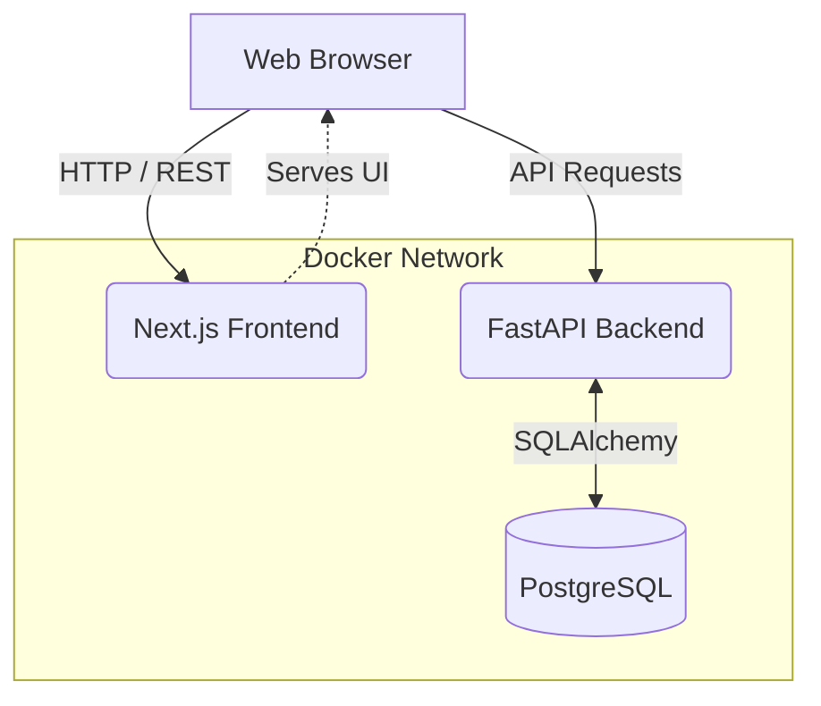
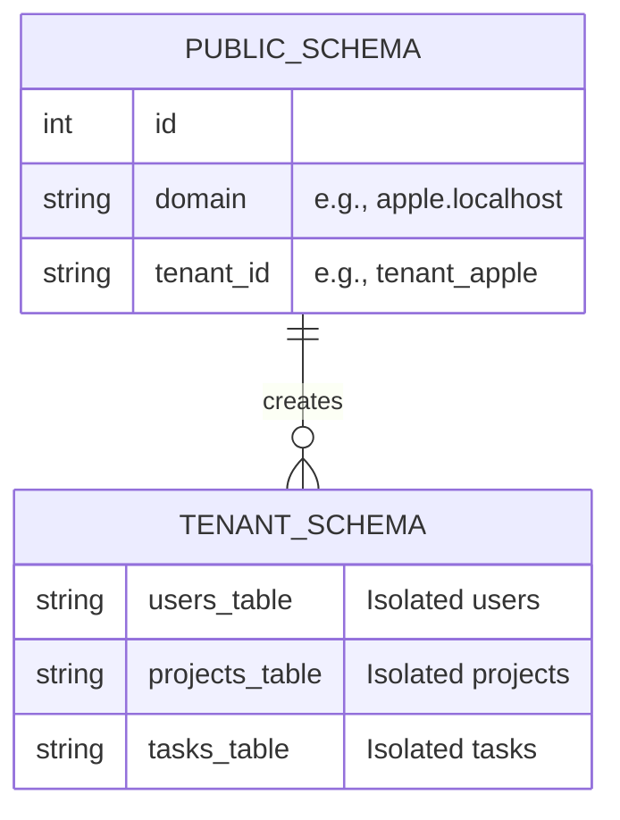
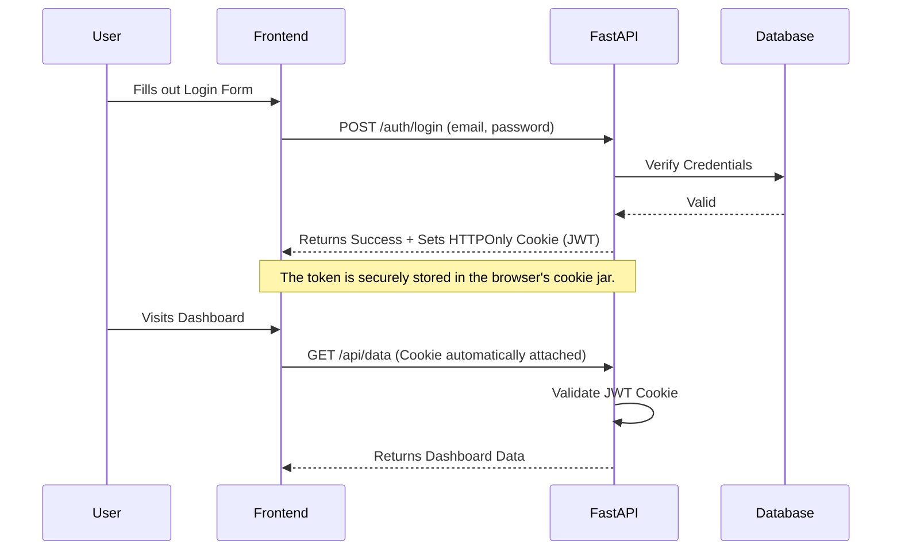

# WorkPilot 🚀

Welcome to **WorkPilot**, a modern, multi-tenant SaaS application designed with scalability, security, and developer experience in mind. 

WorkPilot leverages a robust tech stack to provide isolated workspaces for different companies (tenants) while maintaining a seamless, unified codebase.

---

## 🛠 Tech Stack

### Frontend (User Interface)
* **Framework:** Next.js 16 (App Router)
* **Styling:** TailwindCSS
* **Validation:** Zod + React Hook Form
* **Networking:** Axios (configured for secure cross-origin credential sharing)
* **Language:** TypeScript

### Backend (API Services)
* **Framework:** FastAPI (High-performance Python framework)
* **Database ORM:** SQLAlchemy
* **Database:** PostgreSQL
* **Package Manager:** `uv` (Extremely fast Python package installer)
* **Language:** Python 3.12+

### DevOps & Infrastructure
* **Containerization:** Docker & Docker Compose
* **Architecture:** Multi-Tenant (Schema-per-tenant)
* **Hot-Reloading:** Configured for both Next.js and FastAPI inside Docker

---

## 🏗 Architecture Overview

WorkPilot follows a classic decoupled client-server architecture. The Next.js frontend communicates with the FastAPI backend, which handles business logic and interfaces with a PostgreSQL database.



---

## 🏢 Multi-Tenant Database Design

To ensure strict data privacy and isolation between different companies using WorkPilot, the application uses a **Schema-per-Tenant** architecture. 

When a new company registers (e.g., Apple), the backend automatically generates a brand new database schema specifically for them.



**How it works:**
1. A request comes in from `apple.localhost:3000`.
2. A custom FastAPI `TenantMiddleware` intercepts the request.
3. It looks up `apple` in the public database to find their specific schema.
4. It dynamically routes all subsequent database queries for that request to Apple's isolated schema.

---

## 🔐 Secure Authentication Flow

WorkPilot takes security seriously. Instead of storing sensitive JWT tokens in `localStorage` (which is vulnerable to XSS attacks), it uses **Secure, HTTPOnly Cookies**.



### Additional Security Features
* **Rate Limiting:** A custom `RateLimitMiddleware` protects the backend from spam/DDoS by limiting requests (e.g., max 60 per minute per IP).
* **CORS:** Strictly configured Cross-Origin Resource Sharing that automatically allows verified tenant subdomains (e.g., `*.localhost:3000`).
* **Strong Validation:** Both the Frontend (using Zod) and Backend (using Pydantic) enforce strict schema validation, ensuring passwords meet complexity requirements.

---

## 🚀 Getting Started

Getting WorkPilot running locally is incredibly simple thanks to Docker.

### Prerequisites
* Docker
* Docker Compose

### Start the Application
Simply run the following command in the root directory:

```bash
docker compose up --build
```

**What this does:**
1. Spins up the `workpilot_postgres` database.
2. Builds and starts the `workpilot_auth_service` (Backend on `http://localhost:8000`).
3. Builds and starts the `workpilot_frontend` (Frontend on `http://localhost:3000`).

### Development
Both the frontend and backend are configured with hot-reloading. You can edit React components or Python logic on your host machine, and the changes will instantly reflect inside the Docker containers!

---

## 📁 Repository Structure

```text
work-pilot/
├── auth-service/         # Backend
│   ├── src/
│   │   ├── core/         # Settings, Exceptions
│   │   ├── infrastructure/# DB connections, Middleware
│   │   ├── modules/      # Domain logic (auth, users, etc.)
│   │   └── main.py       # FastAPI application entry point
├── frontend/             # Frontend
│   ├── app/              # Next.js App Router pages
│   ├── components/       # Reusable React components (UI, Auth, etc.)
│   ├── lib/              # Utilities (Axios configuration)
│   └── use-cases/        # API integration layer
└── docker-compose.yml    # Infrastructure configuration
```